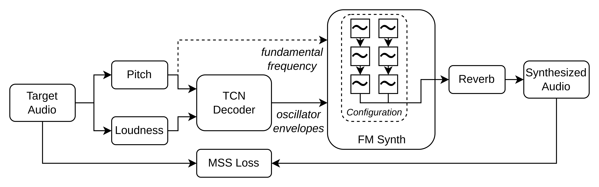

<h1 align="center">DDX7: Differentiable FM Synthesis of Musical Instrument Sounds</h1>
<div align="center">
<h3>
    <a href="http://arxiv.org/abs/2208.06169" target="_blank">paper</a> - <a href="https://fcaspe.github.io/ddx7" target="_blank">website</a>
</h3>
    <p>
    Franco Caspe - Andrew McPherson - Mark Sandler
    </p>
</div>

<center>

</center>

This is the official implementation of the DDX7 paper, accepted to the 23rd International Society
for Music Information Retrieval Conference ([ISMIR 2022](https://ismir2022.ismir.net/)).

## Install

It is reccomended to install this repo on a virtual environment.

```bash
pip install -r requirements.txt
pip install -e .
```

Also make sure `pytorch` is setup with the [CUDA version](https://pytorch.org/get-started/locally/)
that support the capabilities of your GPU.

## About option management

Please note we use [`hydra`](https://hydra.cc/) to personalize dataset generation, and build and train models.
It is reccomended to take a look at the available options in `yaml` files before processing a dataset or training a model.

## Dataset Generation

We used the [URMP](https://labsites.rochester.edu/air/projects/URMP.html) dataset to train and test the models.
Additional test files can be aggregated and used for resynthesis tasks.
Please check the `dataset` directory for advanced options to process and build a dataset.

**Quick start** - will extract and process violin, flute, and trumpet data using [`torchcrepe`](https://github.com/maxrmorrison/torchcrepe).

```bash
cd dataset
python create_data.py urmp.source_folder=/path/to/URMP/Dataset
```

## Training

Please check the `recipes` directory for available models and hyperparameters.
Make sure processed data is at the expected directory.

**Quick start:** - will train a DDX7 model on URMP violin data on the GPU.

```bash
python train.py # override GPU with "device=cpu" option.
```

## Citation
```bibtex
@article{caspe2022ddx7,
    title={{DDX7: Differentiable FM Synthesis of Musical Instrument Sounds}},
    author={Caspe, Franco and McPherson, Andrew and Sandler, Mark},
    journal={Proceedings of the 23rd International Society for Music Information Retrieval Conference},
    year={2022}
}
```